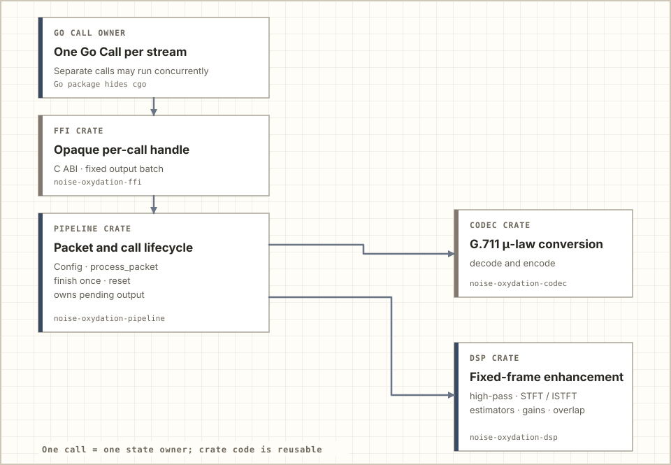
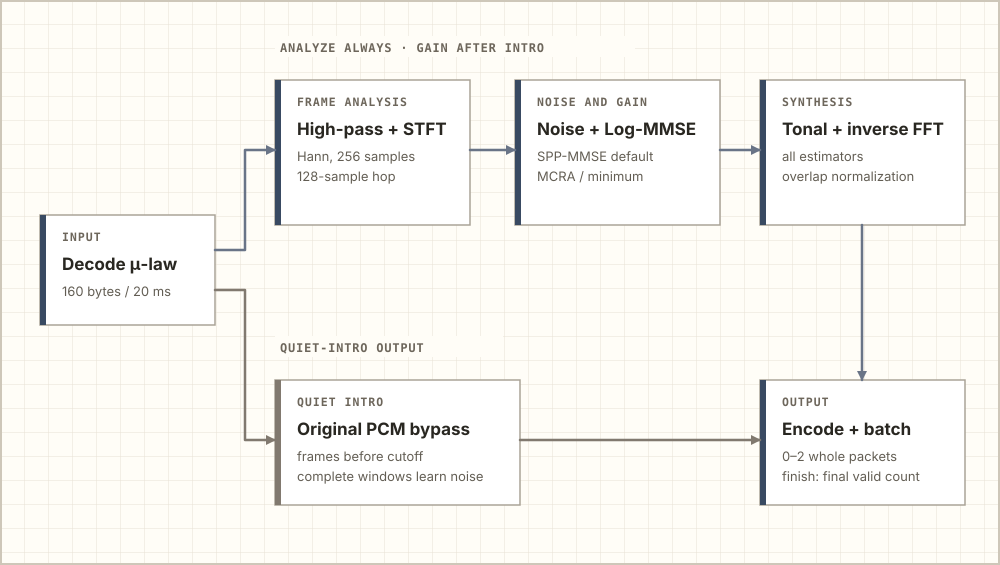

# How Noise Oxydation works

Noise Oxydation enhances one 8 kHz mono G.711 μ-law call through a `Pipeline`. The caller supplies 160-byte packets, receives ordered complete output packets, and calls `finish` once to drain the final valid samples. A quiet call intro lets the pipeline learn a noise baseline before suppression begins.

## Ownership

<picture>
  <source media="(prefers-color-scheme: dark)" srcset="assets/how-it-works/crates-night.svg">
  
</picture>

The Rust 2024 workspace has four crates. `ffi` exports an opaque C handle for Go; it depends on `pipeline`. Rust callers can use `pipeline` directly. `pipeline` owns configuration, packet buffering, and call lifecycle and calls `codec` for μ-law conversion and `dsp` for fixed-frame enhancement. Dependencies point only toward the processing crates. Each Go `Call` owns one handle and serializes its own process, finish, reset, and close operations. Each `Pipeline` contains its own estimator, FFT, tonal, and output state.

Independent calls can run at the same time when the caller schedules separate `Pipeline` instances. Within one call, packets, FFT hops, estimator updates, and `finish` advance that instance in order. The FFI retains no Go buffer. There is no internal worker or shared DSP state.

## One call's audio flow

<picture>
  <source media="(prefers-color-scheme: dark)" srcset="assets/how-it-works/audio-night.svg">
  
</picture>

`process_packet(&[u8; 160])` decodes each 20 ms packet. A first-order high-pass filter feeds a 256-point short-time Fourier transform (STFT). The default conservative mode uses a periodic Hann window and advances every 128 samples. One input packet can complete zero, one, or two conservative hops, so its result can contain zero, one, or two **whole** output packets.

The default `learning_duration` is five seconds and assumes a quiet intro. Complete FFT windows wholly inside the interval update the noise baseline. Frames starting before the conservative cutoff emit the original decoded PCM instead of filtered, reconstructed audio. With the default 40,000-sample interval, the first conservative suppressed frame starts at sample 40,064 (5.008 seconds). A different call setup can configure another duration. The conservative minimum is 256 samples; the experimental minimum is 320 samples, enough for a real-input frame to end on its 80-sample hop boundary.

After the intro, the selected estimator updates one call-owned noise spectrum:

- **SPP-MMSE** is the default. It smooths speech-presence probability for a conditional noise update.
- **MCRA** compares smoothed power with a fixed 50-frame conservative minimum history, then uses speech probability to slow noise updates. A Rust safeguard protects sustained narrowband voice after the window turns over.
- **Minimum estimation** uses the same history as a lower-envelope estimate. It can learn continuous foreground energy.

All three alternatives feed the same decision-directed prior SNR and Log-MMSE gain. Tonal gain then attenuates isolated transient peaks while accounting for neighboring and harmonic evidence. In conservative mode, the modified spectrum passes through inverse FFT, Hann synthesis, and window-square overlap normalization. `codec` encodes the valid output samples back to μ-law.

## Choose processing delay per call

`Pipeline::new` and the zero-value Go mode use the conservative path. It first returns a complete output packet with input packet three. `Pipeline::new_with_mode(config, ProcessingMode::ExperimentalLowDelay)` and Go `Config.Mode = ExperimentalLowDelay` select a separate experimental DSP instance in the same binary. It keeps 256-point analysis, advances every 80 samples, and synthesizes from a 160-sample asymmetric window. Its first complete packet returns with input packet two. Both modes preserve ordered valid audio, quiet-intro bypass, one-time finish, and reset.

The shorter hop performs more FFT work and changes the sound after spectral gains. MCRA and minimum use 80 experimental history frames to retain the conservative 800 ms horizon, but other per-frame smoothing has a different time base. On two credited voices with fixed-seed broadband noise, experimental minimum estimation left more residual noise. The [mode comparison](docs/processing-modes.md) gives exact measurements, reproducible commands, and the limits of this evidence. Keep the conservative default until the experimental tradeoff has been checked on representative calls.

The formulas and safeguards chosen where the Go documentation is incomplete are [recorded separately](docs/reference-observations.md). The [real-speech replay](docs/real-audio-evidence.md) measures this Rust path on one credited clip; it does not establish universal speech quality or exact Go numerical parity.

## End of call and another call

`finish` pads the DSP just enough to emit the remaining valid audio and reports the last packet's valid sample count. With fixed 160-sample inputs, a returned final packet currently has 160 valid samples. A second `finish` or a `process_packet` after finishing returns `AlreadyFinished`. `reset` clears the filter, estimator, tonal, FFT, overlap, pending-packet, and finish state while retaining configuration.

Rust processing and finishing allocate no memory after construction and use no blocking synchronization. The Go wrapper uses a per-call mutex to make `Close` safe against concurrent processing; Go and cgo scheduling do not carry a hard real-time guarantee. The opt-in `logging` feature only writes a status snapshot when the caller explicitly invokes `write_status` outside the audio thread. The opt-in `performance-analysis` examples run offline.

See [Architecture](ARCHITECTURE.md) for the detailed timing and ownership contract and [README](README.md) for a caller example. The project is [MIT licensed](LICENSE).
