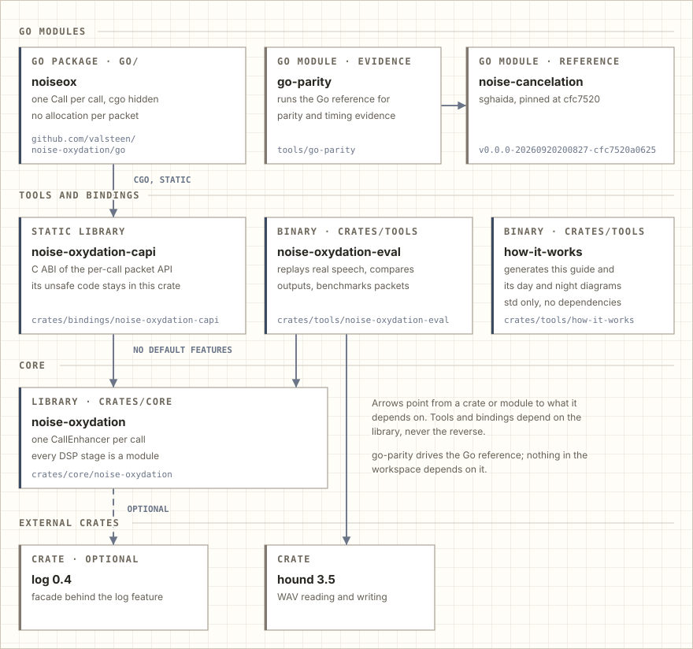
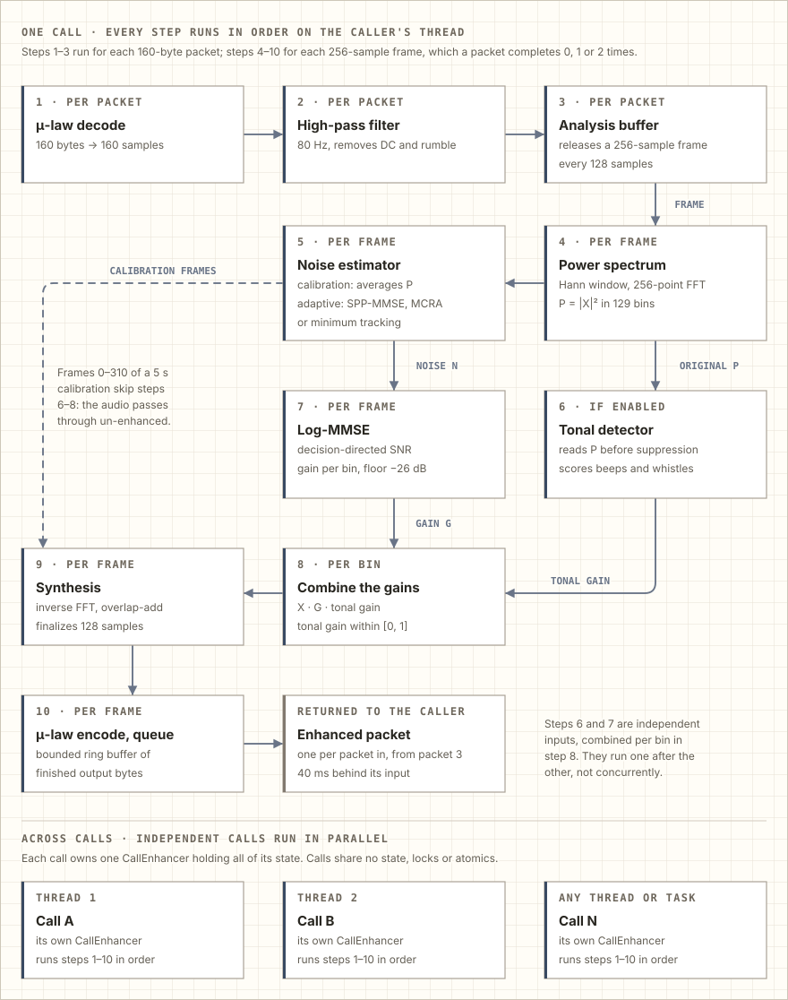
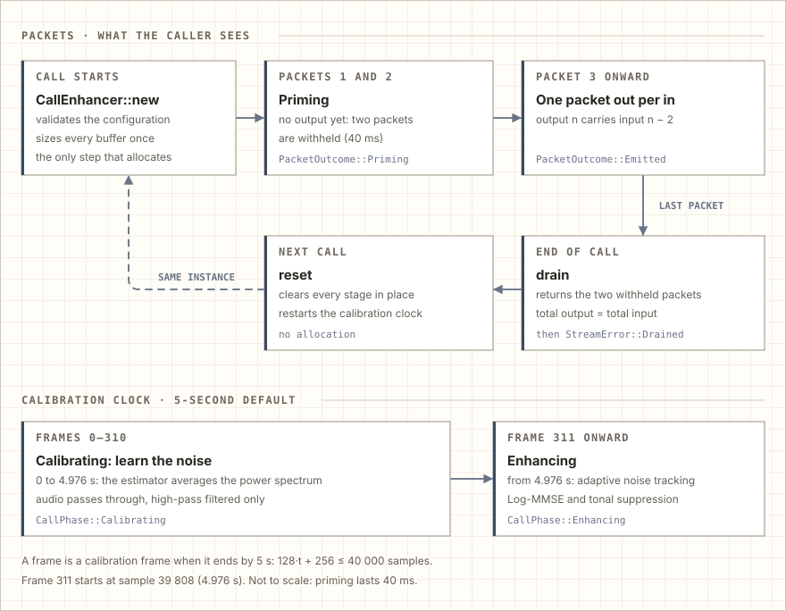

<!-- Generated by crates/tools/how-it-works. Do not edit this file: change the seeds and run `cargo run --locked -p how-it-works`. -->

# How Noise Oxydation works

Noise Oxydation reduces background noise in live phone calls. It is a Rust library for 8 kHz telephone audio carried
in 160-byte G.711 μ-law packets, the format that telephony platforms such as Twilio Media Streams deliver every 20 ms.
Each call gets its own enhancer: you hand it every incoming packet and send on the enhanced packet it returns, 40 ms
later.

This guide shows what the repository contains, what happens to a packet inside a call, what runs one step after
another and what runs in parallel, and what the measurements say. [ARCHITECTURE.md](ARCHITECTURE.md) states the exact
contracts and [docs/algorithms.md](docs/algorithms.md) every equation and default.

## What the repository contains

<picture>
  <source media="(prefers-color-scheme: dark)" srcset="docs/assets/how-it-works/crate-map-dark.svg">
  
</picture>

The library `noise-oxydation` in `crates/core` holds the whole enhancer. It needs only the Rust standard library, plus
the `log` facade for one debug record at construction, which can be compiled out. The tools in `crates/tools` depend on
the library and never the other way round: `noise-oxydation-eval` replays real speech through it, compares outputs and
benchmarks the packet path, and `how-it-works` generates this guide.

The library is a port of the Go project [sghaida/noise-cancelation](https://github.com/sghaida/noise-cancelation).
`tools/go-parity`, a Go module beside the workspace, runs that original on the same audio so the two can be measured
side by side.

## How a call processes a packet

<picture>
  <source media="(prefers-color-scheme: dark)" srcset="docs/assets/how-it-works/processing-flow-dark.svg">
  
</picture>

Steps 1–3 run for every packet. The spectral steps 4–10 run for every analysis frame: 256 samples (32 ms) taken every
128 samples (16 ms), so a 160-sample packet completes zero, one or two frames. Two branches decide how much of each of
the 129 frequency bins to keep:

- **Background noise.** The noise estimator (step 5) tracks the noise spectrum, and Log-MMSE (step 7) turns the ratio
  of observed power to estimated noise into a gain per bin. The decision-directed SNR smooths that ratio over time, so
  the gain does not flutter from frame to frame. The gain never falls below −26 dB: noise is reduced rather than cut
  out, which avoids the "musical noise" and holes that hard spectral subtraction leaves.
- **Foreground tones.** The noise estimator cannot tell wanted speech from a sudden beep, whistle or chirp: both differ
  from the background. The tonal detector (step 6) looks for narrow peaks between 2 and 4 kHz that appear suddenly, move
  in frequency or persist, and spares peaks with harmonic support, which is how voiced speech looks. It attenuates by at
  most 6 dB. It reads the power spectrum before any suppression, and its gain is applied after the Log-MMSE gain
  (step 8).

### Sequential inside a call, parallel across calls

Inside one call nothing runs in parallel. `process_packet` runs the ten steps in order, on the thread that calls it,
for every packet. The two branches are independent inputs combined per bin, but they are computed one after the other:
tonal detection first, then Log-MMSE. The packet path starts no thread, takes no lock and allocates no memory.

Across calls, parallelism is yours to choose. Give each call its own `CallEnhancer` on whatever thread or async task
drives that call. Enhancers share nothing: the library keeps no global mutable state and uses no locks or atomics.
`CallEnhancer` is `Send` and its processing methods take `&mut self`, so the compiler rejects two threads using one
enhancer at the same time. An integration test runs calls with different configurations on parallel threads and checks
that every output is byte-identical to processing the same calls one by one.

## The life of a call

<picture>
  <source media="(prefers-color-scheme: dark)" srcset="docs/assets/how-it-works/call-timeline-dark.svg">
  
</picture>

- **Priming.** The first two packets return `PacketOutcome::Priming` and produce no output. An output sample is final
  only when the two frames that overlap it have been processed, and after two packets only 128 samples are final,
  fewer than one packet.
- **Steady state.** From the third packet on, every packet returns exactly one enhanced packet, carrying the audio of
  the packet received two packets earlier.
- **Drain.** `drain` returns the withheld packets (two, unless the call was shorter), so a call's output has exactly
  as many samples as its input. Further packets are rejected until `reset`.
- **Reset.** `reset` starts the next call on the same instance, clearing every stage in place without allocating.

### The quiet intro

A call is assumed to start with a few seconds of background noise before anyone speaks. During the first 5 seconds
(configurable, zero disables it) the noise estimator averages the power spectrum, and the audio passes through
un-enhanced apart from the high-pass filter. With the 5-second default that covers frames 0–310; frame 311, starting at
4.976 s, is the first enhanced frame.

Speech during the intro is learned as noise, so the first seconds after it are over-suppressed. The replay measured
this by starting the same talker at 0 s instead of 6 s: in the first second after calibration, speech was up to 1.1 dB
(SPP-MMSE, the default), 2.1 dB (minimum estimator) and 5.1 dB (MCRA) quieter than in the undisturbed call, and it was
back within 1 dB after 1 s, 1 s and 3 s respectively
([docs/evaluation.md](docs/evaluation.md#speech-during-calibration)).

## What it achieves

On real recorded speech mixed with real office and cafeteria noise at 5 dB SNR, the default settings remove about 26 dB
of office noise and 11 dB of cafeteria noise in speech pauses, improve segmental SNR by 5.2 and 2.7 dB, and cost the
speech 0.3 and 1.4 dB of level. These are objective measures on one talker per scene, not perceptual ratings;
[docs/evaluation.md](docs/evaluation.md) has every scenario, the listening instructions and the measurement limits.

## Where the time goes

On an Apple M1 Ultra a packet takes about 17 µs on average against its 20 ms cadence, and 99.9 % of packets take less
than 0.09 ms. One call holds 18–44 KB of state, and 100 concurrent calls of two minutes each finish in 0.54–0.72 s.
Per packet, with the default configuration ([docs/performance.md](docs/performance.md#stage-breakdown)):

| Stage | µs per packet | Share |
| --- | ---: | ---: |
| μ-law decode and high-pass | 0.38 | 2.3 % |
| Analysis: window, FFT, power | 1.57 | 9.3 % |
| Noise estimation | 0.97 | 5.8 % |
| Tonal detection | 1.24 | 7.4 % |
| Log-MMSE, with the tonal gain | 10.66 | 63.4 % |
| Synthesis: inverse FFT, overlap-add | 1.57 | 9.4 % |
| μ-law encode and queue | 0.41 | 2.4 % |

Log-MMSE dominates because it evaluates an exponential integral in double precision for each of the 129 bins of every
enhanced frame. Analysis and synthesis cost about 1.6 µs each, nearly all of it FFT, so shifting their 128-sample
buffers is negligible; the finished output bytes already wait in a fixed ring buffer.

## Evidence and limits

- [docs/evaluation.md](docs/evaluation.md): the real-speech replay, its sources, metrics and listening files.
- [docs/performance.md](docs/performance.md): latency, allocation, memory and throughput, the comparison with the Go
  original, and the vectorization investigation.
- [docs/reference-log.md](docs/reference-log.md): every known difference from the Go original, with the measured
  comparison: more than 99.998 % of output bytes are identical on the evaluation recordings.
- [docs/design-principles.md](docs/design-principles.md): which engineering rules this project follows, and why.

The enhancer is a classical single-channel method. It cannot separate a second talker from the wanted one, it treats
strong foreground sounds that are not narrow tones as foreground, and it cannot restore anything above 4 kHz, which
8 kHz telephone audio does not carry.

Parts of the explanations above are adapted from the README of
[sghaida/noise-cancelation](https://github.com/sghaida/noise-cancelation) (MIT License, Copyright (c) 2026 Saddam Abu
Ghaida); see [THIRD_PARTY_NOTICES.md](THIRD_PARTY_NOTICES.md).

---

This guide and its diagrams are generated by <code>crates/tools/how-it-works</code>. Change its seeds and run
<code>cargo run --locked -p how-it-works</code>; CI runs
<code>cargo run --locked -p how-it-works -- --check</code> to keep them current.
