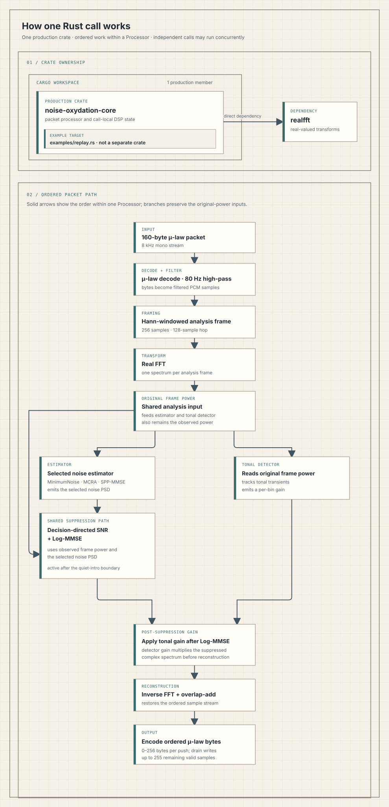

# How the Rust processor works

The Rust core enhances 8 kHz mono audio carried as fixed 160-byte G.711 μ-law packets. One `Processor` owns one call's mutable signal state and emits enhanced samples in order. A separate processor can handle another call concurrently.

<picture>
  <source media="(prefers-color-scheme: dark)" srcset="docs/images/how-it-works-night.svg">
  
</picture>

Open the [day SVG](docs/images/how-it-works-day.svg) or [night SVG](docs/images/how-it-works-night.svg) directly.

## Crate boundary

The Cargo workspace has one production member: `noise-oxydation-core`. The crate depends directly on `realfft` for real-valued transforms. Its `examples/replay.rs` target handles offline WAV access and measurements; it is an example target, not another crate.

## Packet path

Each packet follows this ordered path inside its `Processor`:

1. Decode the 160 μ-law bytes to PCM and apply the 80 Hz high-pass filter.
2. Fill 256-sample Hann-windowed frames at a 128-sample hop, then run the real FFT.
3. Compute original frame power. It feeds both the selected noise estimator and the tonal-transient detector.
4. After calibration, use observed frame power and the selected noise PSD for decision-directed SNR and shared Log-MMSE suppression.
5. Apply the detector's tonal gain to the Log-MMSE spectrum, then inverse-transform, overlap-add, and encode ordered μ-law output.

The estimator is fixed for a processor's call. The default minimum-noise estimator uses smoothing 0.8, a 50-frame minimum window, and a 1e-12 power floor. `Processor::with_estimator` selects MCRA or SPP-MMSE instead.

## Ordering and buffering

One processor handles packet pushes and frames in order. Independent `Processor` instances own separate mutable signal state and may run concurrently; the packet path does not synchronize shared signal state.

A complete first frame needs 256 samples, or 32 ms at 8 kHz. The fixed packet size makes that frame available on the second push. This is buffering arithmetic, not a measured end-to-end latency. A push writes zero to 256 ordered bytes. A final drain writes zero to 255 remaining valid samples and closes the stream. Reset discards any pending tail and starts a fresh call.

## Quiet-intro calibration

The default calibration interval is 40,000 samples, or five seconds. Durations are floored to 8 kHz samples. Only complete 256-sample windows wholly inside the interval train the estimator; the default contains 311 training windows. Frames ending within the interval bypass suppression. The first frame ending beyond it enters the shared suppression path, even if it crosses the boundary. Speech during the intro can affect the learned noise estimate and later be attenuated.

## Offline replay

The dependency-free replay example reads one attributed OpenSLR SLR31 utterance, mixes deterministic synthetic noise, and streams it through the public packet API. Its file access, metrics, timing, and allocation instrumentation stay outside initialized `Processor` calls. The recorded sample-stream metrics describe that one synthetic mix. Playback of the two rendered files was confirmed, but no subjective speech-quality assessment was made. The run does not establish general speech quality, natural-noise robustness, end-to-end scheduling performance, or numerical parity with Go. See [docs/REPLAY.md](docs/REPLAY.md) for attribution, reproduction steps, and measurement limits.
